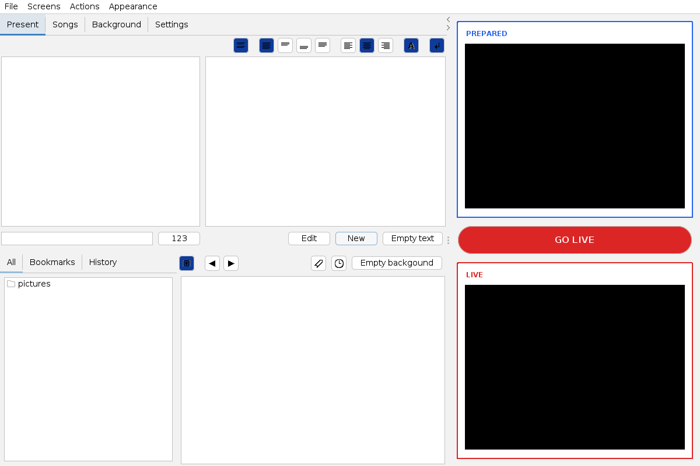
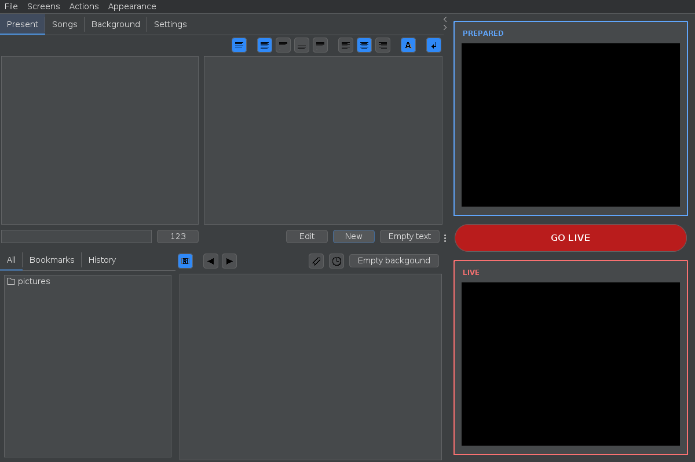

# jWorship

jWorship is a Java Swing desktop application for presenting song lyrics during worship meetings. An operator can search the song library, select a song and one or more verses, preview the result, and send it to a projector or second display.

> [!IMPORTANT]
> `master` is the development baseline. The application builds on Java 21, is verified in CI, and is distributed as self-contained desktop archives. See [Building](BUILDING.md) for supported commands.

## What the application does

The lyrics workflow currently supports:

- searching songs by title and lyrics;
- creating and editing songs;
- splitting lyrics into selectable verses;
- presenting a selected verse, multiple verses, or a blank screen;
- previewing content before it is sent live;
- projecting to a second display;
- changing text alignment, fit, wrapping, shadow, and screen area;
- storing UI labels in English, Slovak, and Polish.

The repository also contains experimental or legacy image, video, JMF, JOGL, and DirectShow code. These areas are outside the initial lyrics-only modernization scope.

## Documentation

- [Development guide](docs/development.md) — repository setup, data formats, local files, and current build limitations
- [Build investigation](docs/build-investigation.md) — Docker-verified blockers and the narrowest recovery path
- [Architecture](docs/architecture.md) — runtime flow, major components, and design boundaries
- [Modernization plan](docs/modernization-plan.md) — phased, test-first route to a maintainable application
- [Contributing](CONTRIBUTING.md) — branch, change, and pull-request conventions

## Repository layout

```text
.
├── pom.xml                         Maven build descriptor
├── src/main/java/sk/calvary/misc
│   ├── lang.lng                     Bundled translations
│   └── …                            Shared utilities and UI models
├── src/main/java/sk/calvary/worship
│   ├── App.java                    Swing entry point and application coordinator
│   ├── Song.java                   Song model and persistence
│   ├── Screen.java                 Lyrics/background render model
│   ├── ScreenView*.java            Preview and projector views
│   ├── panels/                     Operator controls
│   └── effects/ and jmf/           Legacy multimedia code
└── docs/                            Contributor documentation
```

## Build and run

Compile and test with the checksum-verified Maven Wrapper:

```bash
./mvnw verify
```

See [Building](BUILDING.md) for local launch instructions and self-contained release packaging.

## Operator interface

The Swing operator interface uses FlatLaf with light and dark themes. Choose a theme from **Appearance → Theme**. The operator shell keeps prepared content visually separate from the live output and provides a prominent **GO LIVE** action while retaining the `F5` shortcut.

| Light | Dark |
| --- | --- |
|  |  |

## Project direction

Modernization should preserve the reliable live-lyrics workflow before changing the UI or storage format. The first goal is a small, testable lyrics application: song library, fast operator selection, preview, and projector output. Multimedia experiments should be isolated or removed from the default build unless a current requirement and supported replacement are established.
